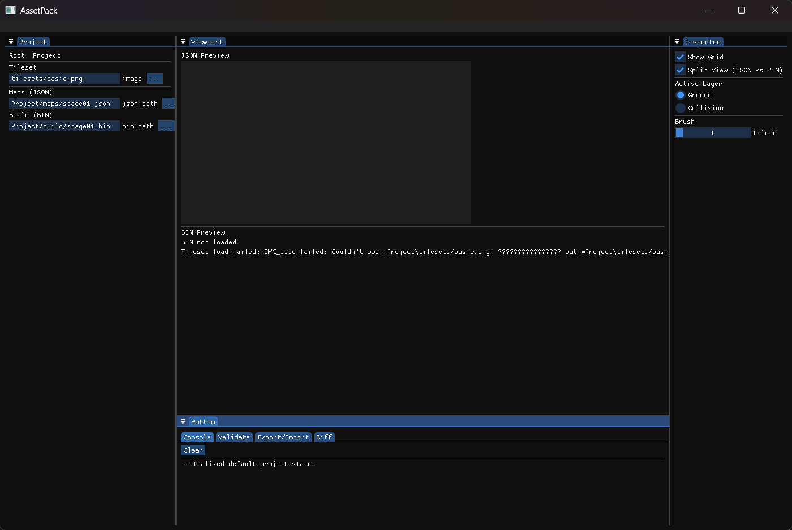
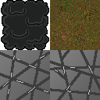

# AssetPack（Tilemap Editor / Exporter）



## 背景・目的

ゲーム開発の現場では、レベルデータやアセット（tileset・マップ・当たり判定など）を「編集しやすい形式（人間向け）」で管理しつつ、実行時には「読み込みが速く壊れにくい形式（機械向け）」へ変換して利用します。
本ツールは、**タイルマップの編集・検証（Validate）・バイナリ出力（Export）・再読込（Import）・差分確認（Diff/Preview）**を1つの exe にまとめ、**アセットパイプラインの最小構成**を実演するために作成しました。

特に以下を重視しています。

* **再現性**：プロジェクト配下の相対パスで管理し、環境依存を減らす
* **検証可能性**：Exportした bin をツール自身が再読込し、見た目・データ差分で確認できる
* **責務分離**：UI / アプリ状態 / ドメインモデル / パイプライン（I/O, Validate, Diff）を分離

---

## 主な機能

* **タイルマップ編集（基本）**

    * レイヤー（例：Ground / Collision）を保持
    * タイルID（tileId）の選択（Brush）
* **Validate（検証）**

    * タイルIDが tileset 範囲外か
    * レイヤーデータサイズが `width*height` と一致するか など
* **Export（JSON → BIN）**

    * 実行時向けの簡易バイナリ形式で出力
* **Import（BIN → Tool）**

    * 出力した bin を読み込み、ツール側で復元
* **Diff（JSON vs BIN）**

    * JSON側とBIN側の差分セルを一覧表示
* **Viewport表示**

    * JSONプレビュー / BINプレビュー（Split）
    * tileset 画像プレビュー（簡易）
    * Brush の選択タイルを Viewport 上にオーバーレイ表示（任意）

---

## 使い方（基本操作）

### 1. 起動

`AssetPack.exe` を実行します。

### 2. JSONの読み込み

* `Maps (JSON)` のパスに対象JSONを指定し、`Load JSON` を押します。

### 3. Validate

* `Validate` タブで `Run Validate` を押すと、Error/Warning が一覧表示されます。
* Error がある場合は Export をキャンセルします（安全側）。

### 4. Export（JSON → BIN）

* `Export/Import` タブで `Export BIN` を押します。
* `Build (BIN)` のパスへ `*.bin` が生成されます。

### 5. Import（BIN → Tool）と Diff

* `Import BIN` で bin を読み込みます。
* `Round-trip Diff (JSON vs BIN)` を押すと差分が表示されます。

    * 差分が 0 なら、Export結果がツール上で再現できていることを確認できます。

---

## テスト用JSON

```json
{
  "version": 1,
  "map": {
    "name": "stage_test_01",
    "width": 16,
    "height": 9,
    "tileSize": 64
  },
  "tileset": {
    "image": "tilesets/basic.png",
    "tileWidth": 2,
    "tileHeight": 2,
    "columns": 2,
    "count": 4
  },
  "layers": [
    {
      "name": "Ground",
      "type": "Tile",
      "visible": true,
      "data": [
        1,1,1,1,1,1,1,1,1,1,1,1,1,1,1,1,
        1,0,0,0,0,0,0,0,0,0,0,0,0,0,0,1,
        1,0,2,2,2,0,0,3,3,3,0,0,2,2,0,1,
        1,0,2,0,2,0,0,3,0,3,0,0,2,0,0,1,
        1,0,2,2,2,0,0,3,3,3,0,0,2,2,0,1,
        1,0,0,0,0,0,0,0,0,0,0,0,0,0,0,1,
        1,0,3,3,0,0,1,1,1,0,0,0,0,0,0,1,
        1,0,3,0,0,0,1,0,1,0,0,0,0,0,0,1,
        1,1,1,1,1,1,1,1,1,1,1,1,1,1,1,1
      ]
    },
    {
      "name": "Collision",
      "type": "Collision",
      "visible": true,
      "data": [
        1,1,1,1,1,1,1,1,1,1,1,1,1,1,1,1,
        1,0,0,0,0,0,0,0,0,0,0,0,0,0,0,1,
        1,0,1,1,1,0,0,1,1,1,0,0,1,1,0,1,
        1,0,1,0,1,0,0,1,0,1,0,0,1,0,0,1,
        1,0,1,1,1,0,0,1,1,1,0,0,1,1,0,1,
        1,0,0,0,0,0,0,0,0,0,0,0,0,0,0,1,
        1,0,1,1,0,0,1,1,1,0,0,1,1,0,0,1,
        1,0,1,0,0,0,1,0,1,0,0,1,0,0,0,1,
        1,1,1,1,1,1,1,1,1,1,1,1,1,1,1,1
      ]
    }
  ]
}
```

---

## テスト用Image



---

## データ形式（概要）

### JSON（編集用）

* `map.width` × `map.height` のセル数を持つ一次元配列 `layers[].data`
* 配列は row-major：`data[y * width + x]`
* `tileId=0` は空（描画しない）想定

### BIN（実行用）

* ヘッダ：magic/version/width/height/tileSize/layerCount
* レイヤータイプ配列 + レイヤーデータ（int32 の連続領域）

---

## フォルダ構成（例）

```
Project/
  tilesets/
    basic.png
  maps/
    stage_test_01.json
  build/
    stage_test_01.bin
```

※パスは原則 **Project基準の相対パス**を推奨します（例：`tilesets/basic.png`）。

---

## 開発環境

* OS：Windows 10/11
* ビルドツール：CMake + Ninja
* コンパイラ：MinGW-w64（g++ / clang でも可）
* IDE：CLion（任意）
* 使用ライブラリ：

    * SDL3（ウィンドウ/入力/レンダリング）
    * Dear ImGui（UI）
    * nlohmann_json（JSON入出力）
    * doctest（ユニットテスト）
    * （必要に応じて）SDL3_image（PNG読み込み用）

---

## ビルド方法

### 1. 依存ライブラリ

`third_party/` 配下に SDL3 / ImGui / nlohmann_json / doctest を配置します。
（FetchContent / submodule どちらでも可。プロジェクト方針に合わせる）

### 2. Configure & Build

```bash
cmake -S . -B build -G Ninja -DCMAKE_BUILD_TYPE=Debug
cmake --build build -j
```

## アーキテクチャ（責務分離）

* `domain/`：データモデル（TileMap/Tileset/Layer）
* `pipeline/`：入出力と検証（JsonIO/BinIO/Validator/Diff）
* `app/`：アプリ状態・ログ・ユースケース（EditorApp/State）
* `ui/`：ImGui描画（Project/Viewport/Inspector/BottomTabs）
* `tests/`：doctest によるユニットテスト

---

## 想定ユースケース（環境開発視点）

* レベルデータの編集と検証をツール側で完結させる
* 実行時データへ変換し、問題を早期に検出する
* 出力物（bin）の可用性をツール自身で検証できる状態にする

---

## 作者
ラ ケツブン
